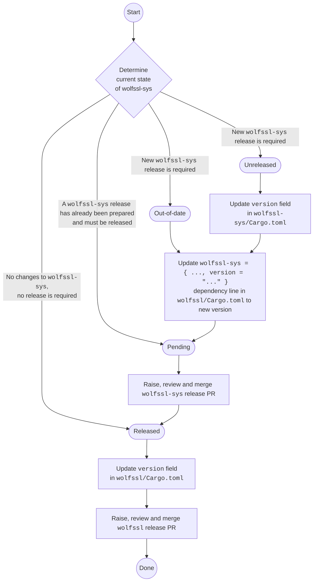

# WolfSSL (Rust)

This repository attempts to build safe and idiomatic abstractions for the [WolfSSL Embedded SSL/TLS Library (C)][wolfssl-home].

There are two parts to this:

- The [`wolfssl-sys`][] crate auto-generates unsafe Rust bindings through [bindgen], to C functions provided by the WolfSSL library.
- The [`wolfssl`][] crate then build safe and idiomatic abstractions on top of the unsafe layer.

[wolfssl-home]: https://www.wolfssl.com/
[`wolfssl-sys`]: ./wolfssl-sys
[`wolfssl`]: ./wolfssl
[bindgen]: https://github.com/rust-lang/rust-bindgen/

## Why WolfSSL?

At [ExpressVPN](https://www.expressvpn.com) we love [WolfSSL](https://www.wolfssl.com). It's fast, secure, easy to use and of course it's Open Source. That's why when we were looking at TLS libraries to use as the core of [Lightway](https://www.lightway.com), WolfSSL was a clear winner. Now that we're doing more research with Rust, it's only natural that we'd want to keep using WolfSSL, but alas, there weren't any Rust bindings available.

So we built one :)

# Building and Running

After cloning this repo, you'll also need to clone the submodules for the WolfSSL source code via:
```
git submodule update --init
```

The project requires `cmake`, `automake` and `autoconf` to build. Use the following command to install the dependencies on macOS:
```
brew install cmake autoconf automake
```

Currently, the usual commands from `cargo` works perfectly fine. Common commands
include the following:

```
cargo build
```

```
cargo test
```

```
cargo clippy
```

## Building with Earthly
There is also an `Earthfile` provided.  For example, here's how you can build the crate in [Earthly](https://earthly.dev):

```
earthly +build-crate
```

For more information about the different Earthly targets available, run:
```
earthly doc
```
## Speeding up development with Earthly Satellites

Please refer to [official documentation for Earthly Satellites](https://docs.earthly.dev/earthly-cloud/satellites).

If you are a member of ExpressVPN, you can get access to the same Earthly organization used in our CI. The organization is named `expressvpn`, inside which contains a satellite named `wolfssl-rs`.

If you are not a member of ExpressVPN, you may set up your own Earthly satellite according the official instructions above.

# Releasing

This repository is a monorepo for two crates: `wolfssl-sys` and `wolfssl`. It is required when releasing `wolfssl` that it depends on an version of `wolfssl-sys` which is up to date with `main`.

There are four possible states for `wolfssl`'s dependency on `wolfssl-sys`:

| State         | Description                                                               |
|---------------|---------------------------------------------------------------------------|
| `released`    | `wolfssl` depends on the latest, most up to date release of `wolfssl-sys` |
| `pending`     | `wolfssl` depends on a pending release of `wolfssl-sys`                   |
| `unreleased`  | `wolfssl-sys` has changes which must be released                          |
| `out-of-date` | `wolfssl` depends on an old version of `wolfssl-sys`                      |

If state is `released` then `wolfssl` can be released without releasing a new version of `wolfssl-sys`.

If state is `out-of-date` or `unreleased` then:

1. Bump the crate version in `wolfssl-sys/Cargo.toml`
1. Update the version specified under `dependencies` in the `wolfssl` crate

The state will now be `pending` (or it already was) so:

1. Release `wolfssl-sys` (Follow the section [Releasing a Single Crate](#releasing-a-single-crate))

Once the most recent `wolfssl-sys` is released and `wolfssl` depends on it then `wolfssl` can be released:

1. Bump the crate version in `wolfssl/Cargo.toml`
1. Release `wolfssl` (Follow the section [Releasing a Single Crate](#releasing-a-single-crate))



## Releasing a Single Crate

A GitHub Workflow is set up to automate the release of crates in this repo. Upon a release, it will create a release in GitHub and Crates.io

To create a new release, follow the below steps:

1. Bump the version in `<crate-name>/Cargo.toml`. We follow the semantic versioning pattern when deciding a new version number
1. Open a PR, attach the `release` label to the PR
1. Observe that a comment is add to the PR, indicating the current version and the upcoming version
1. Merge the PR, a new version should be released to both GitHub and Crates.io
